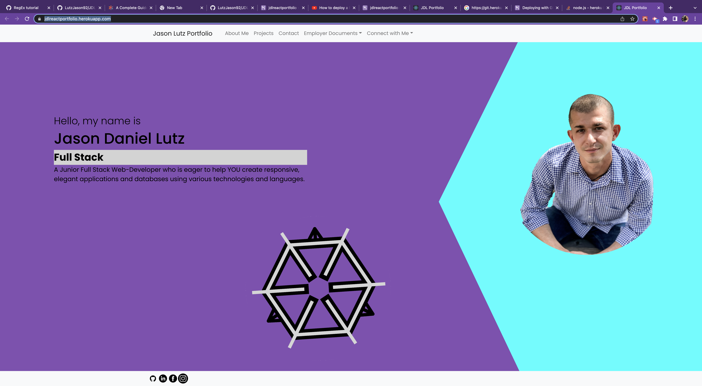

# React Portfolio

[]

## Table of Contents

- [Description](#description)
- [Technologies Used](#technologies-used)
- [Demonstration](#demonstration)
- [Setup](#setup)
- [Usage](#usage)
- [Project Updates](#project-updates)
- [Project Status](#project-status)
- [Have any Questions](#questions)
- [License](#license)

## Project Status

#### The status of Project React Portfolio is currently:

- ##### _in progress_
- ###### The reason: never not improving

## Project Updates

Update with my most recent projects and ones Im most proud of as i develop them.

## Demonstration

Live demo [_here_](https://jdlreactportfolio.herokuapp.com/).

## Description

- This is my online portfolio created with the React Library and deployed through Heroku. It showcases my projects, and provides means to contact me.

## Technologies Used

- React, Node.js, Heroku

## Setup

To use this application, you must have the following technologies installed:

- A web browser

## Usage

- hit this url: https://jdlreactportfolio.herokuapp.com/

## Questions

This application was created by: 

- I encourage you to [send me an email](mailto:LutzJason92@gmail.com)
  if you have any questions or comments.

## Contributors

Thank you to these GitHub users for thier contributions:

- https://github.com/LutzJason92

## License

- This appplication is currently using a mit license.
